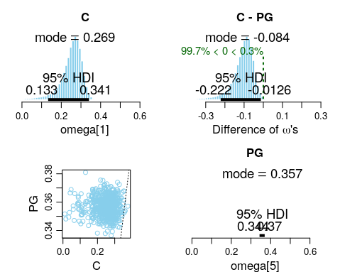

```{r setup, include=FALSE}
knitr::opts_chunk$set(echo = TRUE)
```

With the data from the ESPN NBA website for the regular NBA season of 2018-2019, I will try to model Bayesian Hierarchical modelling to find out the 3 point percentages across the different basketball positions.

The ESPN dataset comprises of players stats with player position assignment as listed in the following:

* PG: Point Guard
* SG: Shooting Guard  
* G: Guard (probably for players who can play both PG and SG)  
* SF: Small Forward  
* PF: Power Forward  
* F: Forward (probably for players who can play both SF and PF)  
* C: Center  

Each act of 3 point shooting is a dichotomous action: for every attempt taken, either the player hits it, or misses it. This can be viewed as a Bernoulli distribution, with the probability of success represented by theta θ. Thus, every player has his individual θ, and across many repeated 3 point attempts, the collection of 3 points shots made out of N attempts becomes a Binomial distribution based on the player's θ and the number of attempts he makes N.

## Simple Modelling
Consider the base case in which every player can be treated as an individual with a 3 point shooting skill set. As with any typical statistical population distribution, there are players with excellent 3 point shooting skills (and thus they have high θ), while there are players with poor 3 point shooting skills (and thus a low θ).

This can be represented by the following:  

$$
P(\theta|Y) = \frac{P(Y | \theta) P(\theta)}{P(Y)}
$$

where Y is the data, theta is the parameter of the Bernoulli distribution.

For a quick summary on Bayes Rule,

* $P(\theta|Y)$: the posterior probability/credibility of the theta parameter given the data Y.  
* $P(Y | \theta)$: The likelihood of the data given the parameter theta  
* $P(\theta)$: The prior/credibility of the parameters without the data D  
* $P(Y)$: the marginal likelihood  

## Simple/Naive Bayesian Hierarchical (BH) Modelling

We can also have the notion that the skills of all players come from a common distribution as parameterised by omega ω. This is akin to saying that we can generate all NBA players' θ from an overarching distribution.

Formally, in addition to each player's 3 point shooting prowess represented by θ, we can integrate another parameter omega ω into the BH model, where ω parameterises the skillset distributions for different positions. 

$$
P(\theta, \omega|Y) = \frac{P(Y | \theta, \omega) P(\theta, \omega)}{P(Y)}
$$

Given that theta is conditional upon omega, we can perform Markov factorisation for the conditional relationship between tehta and omega. Thus, the numerator can be represented by the following:

$$
P(Y | \theta, \omega) P(\theta, \omega) = P(Y | \theta) P(\theta | \omega) P(\omega)
$$
Thus, the overall posterior can be represented by the following:

$$
P(\theta, \omega|Y) = \frac{P(Y | \theta) P(\theta | \omega) P(\omega)}{P(Y)}
$$
where in this case, omega serves as a kind of prior belief for the distribution of theta.

## Bayesian Hierarchical (BH) Modelling of NBA Positions
Different positions will have different skillsets but within each position, players tend to have similar skillsets. This gives us the premise for constructing the Bayesian Hierarchical model.


To help facilitate this train of thought, it is natural to think that PGs tend to have better 3 point shooting skills compared to Centers. Consequently, consider an omega ω_pg that parameterises the distribution of θ_pg for all PGs, while consider a separate omega ω_c that parameterises the distribution of θ_c for all centers. This segmentation of omegas for different positions helps in generating more accurate thetas for the relevant positions since the intra-group properties are not "cross-contaminated" or diluted. This can be seen by the following formulation: 

$$
P(\theta, \omega_{pos}|Y) = \frac{P(Y | \theta) P(\theta | \omega_{pos}) P(\omega_{pos})}{P(Y)}
$$

## Choice of Distributions for BH Model
Before we proceed, we need to define the distributions to be incorporated into the BH modelling. For this example, we will utilise the following distributions:
* Bernoulli distribution
  + Parameterised by θ
  + Limites are 0 and 1
  
* Binomial distribution
  + Parametrised by θ and N
  + Limits are 0 and N
  + Series of N independent Bernoulli trials of the same θ.

* Beta distribution
  + Parameterised by A, B
  + Limits are 0 and 1
  + Note that the mode ω and concentration κ
  + $a = \omega (\kappa-2) + 1, b = (1-\omega)(\kappa -2) +1$
  
* Gamma distribution
  + Parameterised by shape S and rate R
  + Limits are 0 and Infinity
  
## JAGS BH Model Diagram
To create the model syntax for the distributions, we need to incorporate the distributions into the finalised posterior representation as shown:

$$
P(\theta, \omega_{player}, \kappa_{player}, \omega_{pos}, \kappa_{pos}|Y) = \frac{P(Y | \theta) P(\theta | \omega_{player}, \kappa_{player}) P(\kappa_{player}) P(\omega_{player} | \omega_{pos}, \kappa_{pos})  P(\omega_{pos}) P(\kappa_{pos})}{P(Y)}
$$

Note that in the final posterior, we have included additional parameters to fully represent the hierarchical grouping.

 

As shown in the above BH diagram, the posterior is represented by the following distributions:

* Each player's 3 point shooting trial is represented by a Bernoulli distribution parameterised by θ
  - $P(Y|\theta)$
  - The series of 3 point shootings by each player is a Binomial distribution parametrised by θ and number of attempts N. This is not formally shown in the diagram.
* Each player's θ is generated from a Beta distribution as parameterised by the mode ω_player and concentration κ_player
  - $P(\theta | \omega_{player}, \kappa_{player})$
  - Represented by orange dotted lines
* Given that κ_player is conditionally independent on any other parameters, its prior is given separately. This prior is a Gamma distribution.
  - $P(\kappa_{player})$
  - Represented by purple dotted lines
  - Note that since this parameter is at the position grouping level of the hierarchy, we have to create as many priors for each grouping. A similar analogy is that we need a total of N ω_pos/κ_pos parameters for N positions, and thus likewise we need a total of N κ_player parameters.
* Each ω_player is generated from a Beta distribution for each player position grouping as parameterised by ω_pos and κ_pos
  - $P(\omega_{player} | \omega_{pos}, \kappa_{pos})$
  - Represented by pink dotted lines
* Each ω_pos is also defined by a prior distribution which is a Beta distribution
  - $P(\omega_{pos})$
  - Represented by red dotted lines
* Each κ_pos is defined by a prior distribution which is a Gamma distribution
  - $P(\kappa_{pos})$
  - Represented by dark green dotted lines
* Denominator P(Y) represents the marginal distribution of Y
  - Not typically considered in JAGS Markov Chain Monte Carlo (MCMC) simulations as the denominator is a normalisation factor that is cancelled out using the MCMC algorithms (either Metropolis-Hastings or Gibs Sampling)

It is also worth noting that priors are set to be typically vague/non-commital unless one has defined knowledge in the particular field of interest.

## Simulation Results
Using modified scripts from the "Doing Bayesian Data Analysis" to run MCMC simulations on JAGS, we have the following results. 3 MCMC chains with separate initial points were simulated with 500 steps burn-in, and thinning in 100-steps intervals to reduce auto-correlation.

### Overall Distribution for Omega
The parameter "omegaO" represents the overall prior Beta distribution from which the omega_pos parameters are generated.
* The top right graph show that there is a moderate effective sample size (ESS) of 4802. The rule of thumb should be around at least 10,000 in order for the high density intervals (HDI) quantile limits to be trusted, but at above 3000, the estimated mean/mode of the distribution is still reliable. 
* The top left graph shows the exploration of the 3 MCMC chains across the parameter spectrum, and we can observe that the chains did sufficient exploration (remember that omega is from a Beta distribution of limits 0 and 1). 
* The bottom left chart depicts the Gelman plot, which is a diagnostic for comparing the variance across chains against the variance within each chain. Basically, the Gelman-Rubin measures a value called "scale reduction factor" that represents if there is a significant difference between the variance within several chains and the variance between several chains. If the scale factor is above 1.1, it shows that some of the MCMC chains might have gotten stuck and may not have converged correctly. In our case, the scale factors are close to 1.0, which indicates convergence of the chains.
* The bottom right chart depicts the density chart for each chains. Since all chains have similar densities, we can deduce that the simulations corroborated each other. The stated MCSE represents the estimated SD of the sample mean in the chain, on the scale of the parameter value. Since MCSE is small, the standard deviation of the simulations estimates are ok in this case.


### Positional-Based Omega Distributions
For the parameter "omega[x]" where x is the index for each position grouping, it represents the position grouping parameter that is generated from "omegaO". The following plot compiles all the generated probabilitiy distribution for each position's omega, where omega[1] represents the mode for the beta distribution for Centers and omega[7] represents the mode for the beta distribution for Shooting Guards. The 95% (default) HDI of each distribution is shown, but unfortunately for certain positions, the distributions are so narrow that the superimposed text "blocks" each other out (for example as seen in omega[7] SG).


As expected, big men roles such as Centers and Forwards do have much poorer 3 point shooting accuracy in general compared to backcourt roles such as Point Guards or Shooting Guards. This can be seen from the modes of the distributions. Additionally, Centers and Forwards also have a much wider variance in their distributions compared to PGs/SGs. We know this to be true when there are players such as Karl-Anthony Towns or Kevin Love who have exceptional 3 point shooting abilities, while there are other centers such as Rudy Gorbert or Deandre Jordan who do not have that touch.

Interestingly, Power Forward roles seem to have an exceptional 3 point shooting percentages. Upon inspection of the data, players such as Pascal Siakam and Danilo Gallinari are included. There are some PFs who do have poor 3 point shooting percentages, but those who have poor shooting tend to takes less shots in total. This can explain the "shift" towards a higher than expected 3 point shooting percentage for this position.

Another interesting discovery is that for the G position, the mode of the distribution is actually lower than that of PFs. 

### Difference in Positional Omegas
We can also determine the difference in omega values for the different positions.

A simple comparion between Center and PG positions is shown below. The plots on the top left and bottom right shows the histogram distributions for each position's omega values, while the plot on the top right shows the simulated difference. We can see that for (C - PG), the mode of the difference is -0.084. However, this is insufficient for us to conclude that there is a significant difference. To do that, we rely on the HDI intervals of the histogram. Reading off the plot tells us that 99.7% of the histogram lies below 0, while only 0.3% lies above. Similarly the 95% HDI upper limit is at -0.0126. Thus, we can conclude that there is a significant difference between the 3 point shooting percentages of C versus PGs.



We can do a similar comparison for PF vs G positions. Note that we previously encountered that PFs have a surprisingly good 3 point shooting percentage, and also that Gs have a lower shooting percentage than PFs. As shown in the top right plot, the key value of 0 lies between the 95% HDI credible interval limits of the difference in positional omegas. Thus we cannot conclude that there is a difference between the 3 point shooting percentage of PFs versus Gs.


### Individual Player's Theta Comparison 

We can also find out player specific performances. Comparing two elite players in different positions (James Harden versus Karl-Anthony Towns), we now observe that in all of the histogram plots there is a red cross. This red cross represents the original individual player data without consideration of the hierarchy of positions. For example, we see that for Karl-Anthony Towns, his individual percentage is 139/354 = 39.27%. The mode of his theta histogram which is shown to be at 38.8% which is relatively lower. This is because there is "shrinkage" due to the positional information incorporated into the BH modelling, where Centers have much poorer shooting percentages at 26.9%. 

This shrinkage effect is not as evident in James Harden, whose actual 3 point shooting percentage was 374/1030 = 36.3% compared to the positional mode value of 36.6%. 


It is worth highlighting that the term "shrinkage" may be interpreted wrongly. It does not always mean that the value estimated is reduced. In fact it works both ways. For those who have individual modes that are below the positional/group mode value, it will increase their estimated individual mode. Vice versa for those with individual modes above the position/group mode values. The concept of "shrinkage" applies in terms of shrinking towards the group value. 

This can be further illustrated by the comparison between Stephen Curry and Jusuf Nurkic. Stephen Curry has an shooting percentage of 352/807 = 43.6% which is way above the positional PG mode of 35.7%. This brings his estimated shooting percentage to 41.8%. On the other hand, Jusuf Nurkic has made 0 out of 29 attempts, but based on the positional information (mode = 26.9%), his estimated shooting percentage is 6.18%.


## Summary

In this analysis, I have demonstrated the application of Bayesian Hierarchical modelling with NBA positional information for 3 point shooting percentages. We also went through some diagnosis of MCMC simulations, and how to verify that the simulations are reliable. Additionally, we went through some analysis of the shooting percentages for each position and for certain players. With hiearchical modelling came a key concept of "shrinkage", which was also illustrated when we compare players within each position and how the positional information impacted their estimated shooting percentages.

A large part of this analysis was based on the book [Doing Bayesian Data Analysis](https://sites.google.com/site/doingbayesiandataanalysis/) by John Kruschke.