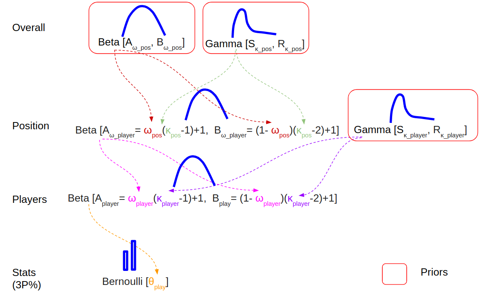

Bayesian Hiearchical Modelling of NBA 3 point shooting
================
Kenneth Foo
02/01/2020

With the data from the ESPN NBA website for the regular NBA season of
2018-2019, I will try to model Bayesian Hierarchical modelling to find
out the 3 point percentages across the different basketball positions.

The ESPN dataset comprises of players stats with player position
assignment as listed in the following:

  - PG: Point Guard
  - SG: Shooting Guard  
  - G: Guard (probably for players who can play both PG and SG)  
  - SF: Small Forward  
  - PF: Power Forward  
  - F: Forward (probably for players who can play both SF and PF)  
  - C: Center

Each act of 3 point shooting is a dichotomous action: for every attempt
taken, either the player hits it, or misses it. This can be viewed as a
Bernoulli distribution, with the probability of success represented by
theta θ. Thus, every player has his individual θ, and across many
repeated 3 point attempts, the collection of 3 points shots made out of
N attempts becomes a Binomial distribution based on the player’s θ and
the number of attempts he makes N.

## Simple Modelling

Consider the base case in which every player can be treated as an
individual with a 3 point shooting skill set. As with any typical
statistical population distribution, there are players with excellent 3
point shooting skills (and thus they have high θ), while there are
players with poor 3 point shooting skills (and thus a low θ).

This can be represented by the following:

  
 = \\frac{P(Y | \\theta) P(\\theta)}{P(Y)}
")  

where Y is the data, theta is the parameter of the Bernoulli
distribution.

For a quick summary on Bayes
    Rule,

  - "): the posterior probability/credibility of the theta
    parameter given the data Y.  
  - "): The likelihood of the data given the parameter
    theta  
  - "): The prior/credibility of the parameters without the
    data D  
  - "): the
    marginal likelihood

## Simple/Naive Bayesian Hierarchical (BH) Modelling

We can also have the notion that the skills of all players come from a
common distribution as parameterised by omega ω. This is akin to saying
that we can generate all NBA players’ θ from an overarching
distribution.

Formally, in addition to each player’s 3 point shooting prowess
represented by θ, we can integrate another parameter omega ω into the BH
model, where ω parameterises the skillset distributions for different
positions.

  
 = \\frac{P(Y | \\theta, \\omega) P(\\theta, \\omega)}{P(Y)}
")  

Given that theta is conditional upon omega, we can perform Markov
factorisation for the conditional relationship between tehta and omega.
Thus, the numerator can be represented by the following:

  
 P(\\theta, \\omega) = P(Y | \\theta) P(\\theta | \\omega) P(\\omega)
")  
Thus, the overall posterior can be represented by the following:

  
 = \\frac{P(Y | \\theta) P(\\theta | \\omega) P(\\omega)}{P(Y)}
")  
where in this case, omega serves as a kind of prior belief for the
distribution of theta.

## Bayesian Hierarchical (BH) Modelling of NBA Positions

Different positions will have different skillsets but within each
position, players tend to have similar skillsets. This gives us the
premise for constructing the Bayesian Hierarchical model.

To help facilitate this train of thought, it is natural to think that
PGs tend to have better 3 point shooting skills compared to Centers.
Consequently, consider an omega ω\_pg that parameterises the
distribution of θ\_pg for all PGs, while consider a separate omega ω\_c
that parameterises the distribution of θ\_c for all centers. This
segmentation of omegas for different positions helps in generating more
accurate thetas for the relevant positions since the intra-group
properties are not “cross-contaminated” or diluted. This can be seen by
the following formulation:

  
 = \\frac{P(Y | \\theta) P(\\theta | \\omega_{pos}) P(\\omega_{pos})}{P(Y)}
")  

## Choice of Distributions for BH Model

Before we proceed, we need to define the distributions to be
incorporated into the BH modelling. For this example, we will utilise
the following distributions: \* Bernoulli distribution + Parameterised
by θ + Limites are 0 and 1

  - Binomial distribution
      - Parametrised by θ and N
      - Limits are 0 and N
      - Series of N independent Bernoulli trials of the same θ.
  - Beta distribution
      - Parameterised by A, B
      - Limits are 0 and 1
      - Note that the mode ω and concentration κ
      -  + 1, b = (1-\\omega)(\\kappa -2) +1")
  - Gamma distribution
      - Parameterised by shape S and rate R
      - Limits are 0 and Infinity

## JAGS BH Model Diagram

To create the model syntax for the distributions, we need to incorporate
the distributions into the finalised posterior representation as shown:

  
 = \\frac{P(Y | \\theta) P(\\theta | \\omega_{player}, \\kappa_{player}) P(\\kappa_{player}) P(\\omega_{player} | \\omega_{pos}, \\kappa_{pos})  P(\\omega_{pos}) P(\\kappa_{pos})}{P(Y)}
")  

Note that in the final posterior, we have included additional parameters
to fully represent the hierarchical grouping.

As shown in the above BH diagram, the posterior is represented by the
following distributions:

  - Each player’s 3 point shooting trial is represented by a Bernoulli
    distribution parameterised by
        θ
      - ")
      - The series of 3 point shootings by each player is a Binomial
        distribution parametrised by θ and number of attempts N. This is
        not formally shown in the diagram.
  - Each player’s θ is generated from a Beta distribution as
    parameterised by ω\_player and κ\_player
      - ")
  - Given that κ\_player is conditionally independent on any other
    parameters, its prior is given separately. This prior is a Gamma
    distribution.
      - ")
  - Each ω\_player is generated from a Beta distribution for each player
    position grouping as parameterised by ω\_pos and κ\_pos
      - ")
  - Each ω\_pos is also defined by a prior distribution which is a Beta
    distribution
      - ")
  - Each κ\_pos is defined by a prior distribution which is a Gamma
    distribution
      - ")
  - Denominator P(Y) represents the marginal distribution of Y
      - Not typically considered in JAGS Markov Chain Monte Carlo (MCMC)
        simulations as the normalisation factors are cancelled out using
        the MCMC algorithms (either Metropolis-Hastings or Gibs
        Sampling)

It is also worth noting that priors are set to be typically
vague/non-commital unless one has defined knowledge in the particular
field of interest.

# Simulation Results

# Shrinkage
