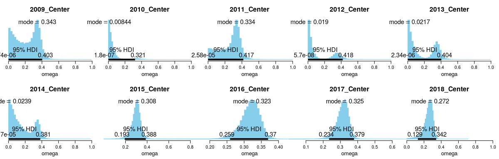
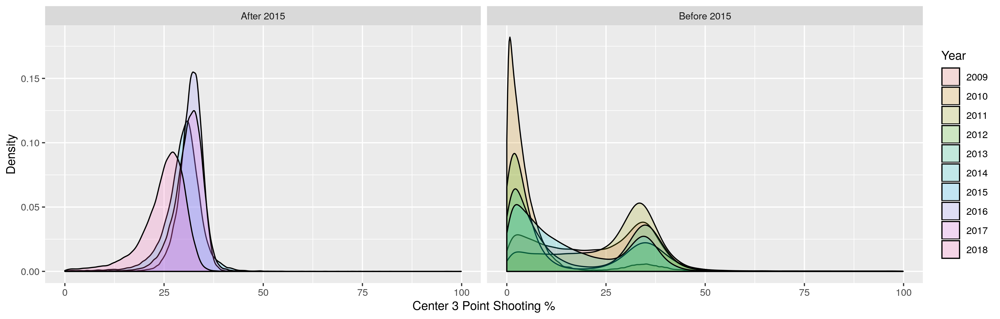
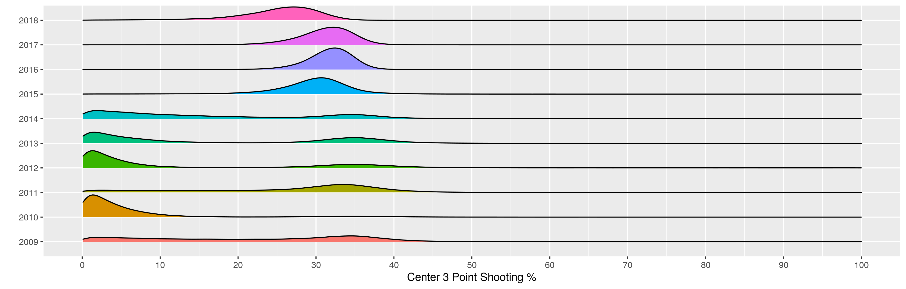
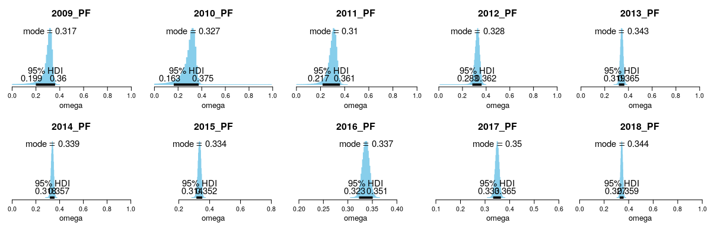
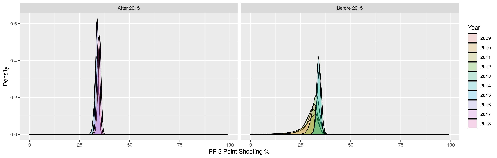
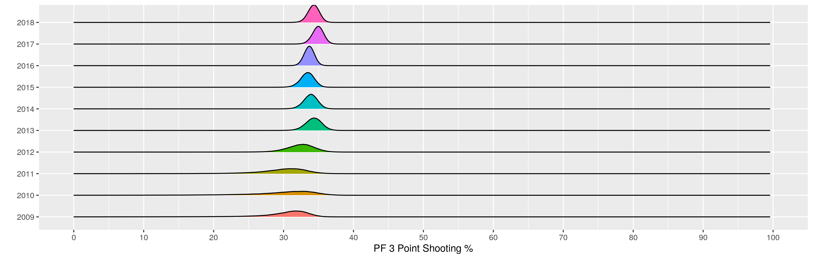

Analysis of 3 Point Shooting Skills of Big Men Positions Across a Decade
================
Kenneth Foo
11/02/2020

If you have been following the NBA 2019/20 season, you may have heard
about Andre Drummond’s recent trade and the lack of interest in him by
other teams during the phase of trade rumours. A center like Andre
Drummond has strong post-up offensive skills and rebounding capabilities
but it may not fit the modern NBA game that has a demand on 3 point
shooting and floor spacing. A motivation for this analysis topic is to
verify how the big men positions have evolved to fit the current systems
with respect to their 3 point shooting abilities.

With the previous
[article](https://github.com/kfoofw/nba_espn/blob/master/3.analysis/threepoint_2018-19/Bayesian-Hierarchical-Modelling-of-3-point-shooting.md)
analysing the 3 point shooting skills for different players and
positions in the 2018-2019 regular season using Bayesian Hierarchical
(BH) modelling, let us take another look at how the 3 point shooting
skills for big men positions (Center and PF positions) have evolved
across the years.

## Methodology Summary

For the regular seasons starting from 2009/10 to 2018/19, Markov Chain
Monte Carlo (MCMC) simulations were generated based on the BH modelling
of the posterior for different players. For those who are not familiar
to it, we incorporate player positions information in a hierarchical
structure that provides a good basis for generating individual players’
skills. This is based on the generally sound assumption that players
within different positions have more homogenous skills. The R script
used for this analysis can be found in this
[folder](../../2.analysis_scripts/threepoint_allseasons).

## Analysis of Position: Center

Based on the simulations, we can observe that there is an evolution
across the years within the
decade.

From 2009 to 2014, the 3 point shooting percentages for centers were
typically bimodal. We can postulate that within center positions, there
might have been 2 types of players: those with exceptional 3 point
shooting averages of around 35%, and those with much poorer shooting
averages under 10%. Across each year, we see the “ebb and flow” of the 3
point shooting skills:

  - In 2009/10, we see a relatively equal spread mix of players skills
    between the abovementioned 2 types of player skills.
  - In 2010/11, there was a receding trend of center players with good 3
    point shooting skills, as shown by the heavy density mass occupying
    the low shooting average range.
  - In 2011/12, the trend was reversed; it seems like centers with good
    3 point shooting were in demand again.
  - In 2012/13, centers were attributed with low 3 point shooting
    averages again.
  - From 2012/13 to 2014/15, we see the gradually increasing focus on
    centers with good 3 point shooting averages.
  - From 2014/15 onwards, it seems like NBA center players finally had a
    convergence of player 3 point shooting skills, as shown by the
    unimodal distribution. There was no reversal in this trend ever
    since, and Centers are generally now equipped with better 3 point
    shooting skills.

Here is another perspective of the Center density plots for all years,
as segmented by seasons before 2015/16 and seasons (inclusive of and)
after
2015/16.

It does seem like there is some deterioration in the 3 point shooting
skills from 2017/18 to 2018/19 regular season.

For an extra visualisation perspective, we can take a look at the
density ridgeline plots for all years in the past
decade.

Something worth noting is that for seasons before 2015/16, there were
actually centers with superior 3 point shooting abilities even compared
to the seasons including and after 2015/16. This can be seen by the non
negligible density mass occupying between 37.5% to 42%.

There also seems to be some form of deterioration of 3 point shooting
skills for Centers in 2018/19 compared to the 2017/18 seasons. Not only
did the mode reduce drastically from 32.5% to 27.2%, we also observe a
substantial shift in the density mass with an expansion of the high
density interval (HDI) range of 95% credibility.

## Analysis of Position: Power Forwards

The 3 point shooting development within Power Forwards are not as
exciting, but there are certain highlights worth
noting.

Throughout the decade, there is an increasing improvement in 3 point
shooting skills amongst PFs. - This is observed by the gradual shift of
probability mass towards the higher shooting average range. -
Accompanying that is the general increasing trend in modes which has
improved from between 31.8% average in the first 3 years to 34.4%
average in the last 3 years - The HDI ranges of 95% credibility across
the years been becoming “sharper” and narrower. The last few years have
HDI ranges of 3% shooting, which is incredible to me.

Similar to what we did for Centers, here is another perspective of the
PF density plots for all years, as segmented by seasons before 2015/16
and seasons (inclusive of and) after
2015/16.

It does seem that the the regular season of 2015/16 seems to represent a
peak transition period for 3 point shooting for PFs in tandem with
centers (as previously observed). For seasons including and after
2015/16, we can see a higher density mass around the peak of the mode,
which also corresponds to the narrowing of the 95% HDI range that was
mentioned.

The density ridgeline plots of PF 3 point shooting shows an interesting
development. In regular seasons 2013/14 and 2014/15, we can observe that
there is a non-negligible proportion of exceptional 3 point shooting
skills compared to 2015/16 and 2016/17 season as shown by the density
mass occupying the regions beyond 35%.

Similar to what we observe in the Centers, the 2018/19 regular season
marks a downturn in terms of 3 point shooting skills in PFs compared to
the previous seasons. Perhaps there is a systematic change that had a
causal impact on both positions in terms of 3 point shooting.

## Limitations of Analysis

The center positions in the past demonstrated bimodal distributions,
which thus implies that the BH model used may not be as appropriate
(given that it was under the assumption that players within a specific
position possess a relatively homogenous set of skills).

Even though it may not be as appropriate, it was a pretty interesting
experience to actually discover the bimodal distributions for Center 3
point shooting averages in the early part of the decade.

## Summary

In this analysis, I generated the MCMC results of a Bayesian
Hierarchical model of NBA 3 point shooting skills for Centers and Power
Forwards across the decade from 2009/10 to 2018/19. With that, we took a
look at how the modern NBA game has caused the big men position to
evolve their 3 point shooting skills.

We discovered that for Centers, there used to be bimodal distributions
indicating heterogenity among player skillsets in that position.
However, as the game developed, the skillset slowly converged towards a
Center profile with decent 3 point shooting average.

For PFs, we observed that there is a big focus on 3 point shooting skill
development, and this skillset evolved to be relatively homogenous among
players in that position as shown by the narrowing of the HDI ranges.

A large part of this analysis was based on the book [Doing Bayesian Data
Analysis](https://sites.google.com/site/doingbayesiandataanalysis/) by
John Kruschke.
